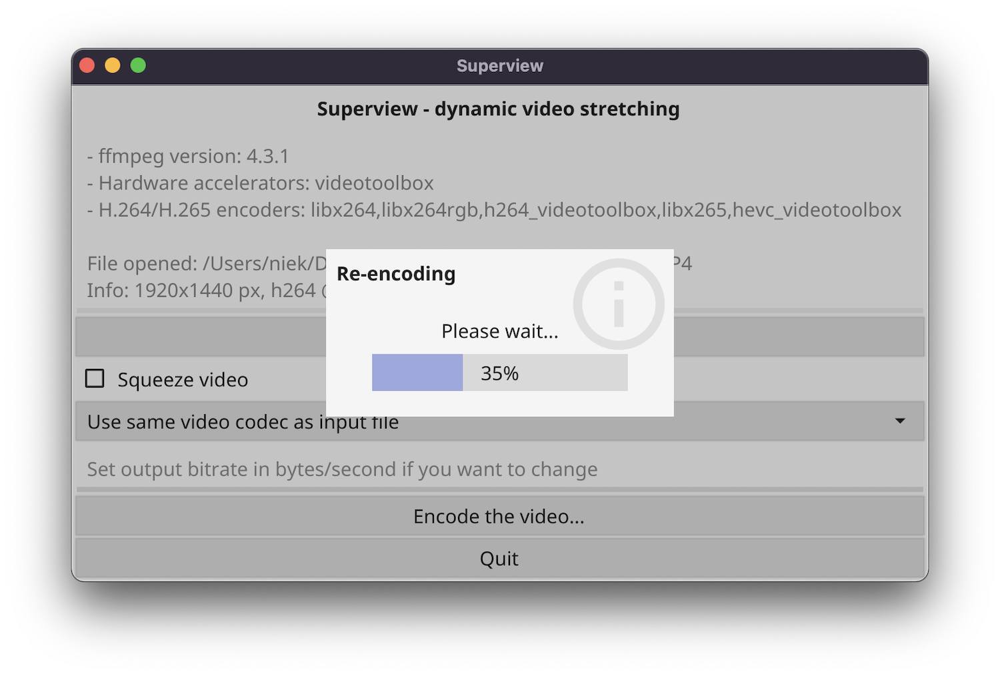

# Superview
<!-- ALL-CONTRIBUTORS-BADGE:START - Do not remove or modify this section -->
[](#contributors-)
<!-- ALL-CONTRIBUTORS-BADGE:END -->

This is a small Go program that takes a 4:3 aspect ratio video file, and transforms it to a 16:9 video using the [GoPro SuperView](https://gopro.com/help/articles/question_answer/What-is-SuperView) method. This means that the image is not naively scaled, but a dynamic scaling is applied where the outer areas are stretched more while the center parts stay close to the original aspect rate.

This is not a 1-1 copy of the GoPro algorithm, but an attempt to reach similar quality of output using the open-source [FFmpeg](https://ffmpeg.org/) encoder.

Credits for the idea go to _Banelle_, who wrote the [initial (Python) implementation](https://intofpv.com/t-using-free-command-line-sorcery-to-fake-superview).

Here is a quick animation showing the scaling, note how the text in the center stays the same:


## Requirements

This program requires FFmpeg to be installed on your computer. If needed, please install it using one of these ways:

- **Linux**: install from your local package manager, for example: `apt instal ffmpeg`
- **Windows**: Download from https://www.gyan.dev/ffmpeg/builds/ and extract the `ffmpeg-release-full` 7ZIP file in the same directory as superview
- **macOS**: Download from https://evermeet.cx/ffmpeg/ and put in the same folder as superview, or install using Homebrew: `brew install ffmpeg`

## Installation

Download the latest release from the [releases page on GitHub](https://github.com/Niek/superview/releases). There are two versions: a graphical version called `superview-gui` and a command line program called `superview-cli`.

## Usage

#### GUI
To run `superview-gui`, simply double-click the icon. Choose an input video file, optionally change some settings and click "Encode". The program will ask you where to save the output.



#### CLI
To use `superview-cli`, run the program with the `-i` (input file) parameter. Optionally, you can provide a `-o` (output) and `-b` (bitrate) parameter. Full usage instructions:

```
Usage:
  superview-cli [OPTIONS]

Application Options:
  -i, --input=FILE         The input video filename
  -o, --output=FILE        The output video filename (default: output.mp4)
  -e, --encoder=ENCODER    The encoder to use, use -h to see a list. If not specified, it takes the standard encoder of the input file codec
  -b, --bitrate=BITRATE    The bitrate in bytes/second to encode in. If not specified, take the same bitrate as the input file
  -s, --squeeze            Squeeze 4:3 video stretched to 16:9 (e.g. Caddx Tarsier 2.7k60)

Help Options:
  -h, --help               Show this help message
```

## Development

If you want superview from source, run `go build superview-gui.go` or `go build superview-cli.go` depending on which version you'd like to build. See [build.sh](/build.sh) for an example how to cross-compile.

## Contributors ✨

Thanks goes to these wonderful people ([emoji key](https://allcontributors.org/docs/en/emoji-key)):

<!-- ALL-CONTRIBUTORS-LIST:START - Do not remove or modify this section -->
<!-- prettier-ignore-start -->
<!-- markdownlint-disable -->
<table>
  <tr>
    <td align="center"><a href="https://github.com/naorunaoru"><br /><sub><b>Roman Kuraev</b></sub></a><br /><a href="#ideas-naorunaoru" title="Ideas, Planning, & Feedback">🤔</a> <a href="https://github.com/Niek/superview/commits?author=naorunaoru" title="Code">💻</a></td>
    <td align="center"><a href="https://github.com/dangr0"><br /><sub><b>dangr0</b></sub></a><br /><a href="https://github.com/Niek/superview/issues?q=author%3Adangr0" title="Bug reports">🐛</a></td>
    <td align="center"><a href="https://github.com/dga711"><br /><sub><b>DG</b></sub></a><br /><a href="#ideas-dga711" title="Ideas, Planning, & Feedback">🤔</a> <a href="https://github.com/Niek/superview/commits?author=dga711" title="Tests">⚠️</a></td>
  </tr>
</table>

<!-- markdownlint-enable -->
<!-- prettier-ignore-end -->
<!-- ALL-CONTRIBUTORS-LIST:END -->

This project follows the [all-contributors](https://github.com/all-contributors/all-contributors) specification. Contributions of any kind welcome!